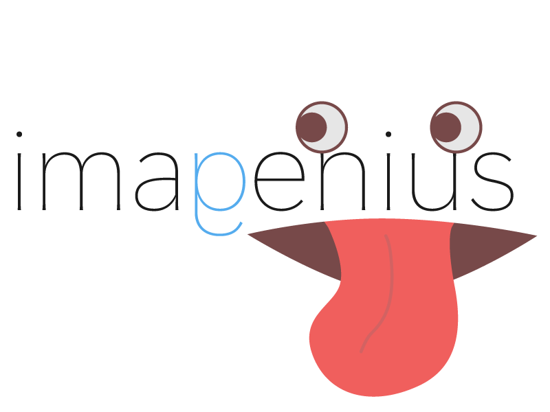

# Imagenius
面白画像でスマートなTwitterライフを

# 機能  
- TL、リプ通知の表示
- いいね、リツイート、リプライボタン
- ツイート
- 面白画像の検索とはりつけ
 
いいね、リツイート、リプライやツイートの詳細、ツイートしたユーザープロフィールの情報へはスワイプしてあらわれるボタンをタップすることでできます。

# 使用ライブラリ
- Swifter
- Alamofire
- SwiftyJSON
- Google-Mobile-Ads-SDK
- DZNEmptyDataset
- SWTableViewCell
- KTCenterFlowLayout
- TTTAttributedLabel

# リンク
- [初めてのオリジナルiPhoneアプリをつくるまで](http://qiita.com/touyoubuntu/items/ea7b42e00050083bd2ff)
